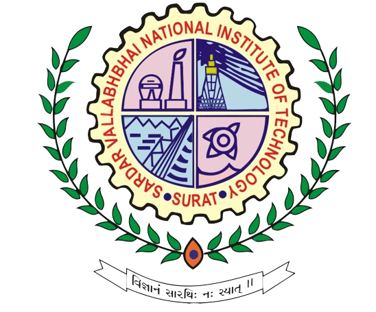

  
  

# SVNIT_CTF_S1_CHELLENGES
security is not a set of products – it's a set of practices

Welcome to the **Capture The Flag (CTF) Challenge!** 🚀
Test your cybersecurity skills by navigating through the Challenge, avoiding traps, and uncovering hidden clues. Can you decrypt the final flag?

## 👨‍💻 Challenges & Categories:
🔹 **Web Exploitation** – Test vulnerabilities in web applications.
🔹 **Cryptography** – Crack encoded messages and encrypted data.
🔹 **Forensics** – Analyze digital artifacts and recover data.
🔹 **Reverse Engineering** – Decompile and understand programs.
🔹 **OSINT** – Find hidden information using open-source intelligence.
🔹 **Miscellaneous** – Fun and tricky cybersecurity puzzles!

Infrastructure & Setup:
🔸 **Pre-configured Machines Provided**: The organizing team will provide:
        **Kali Linux** – Pre-installed with hacking tools for solving challenges.
        **Ubuntu Machine** – A challenge where participants must bypass login credentials to retrieve the flag.

🔸 **Networking & Access**: Secure local/remote access to challenge machines.
🔸 **Online Platform**:  CTFd custom platform].
🔸 **Rules & Ethics**: Strictly ethical hacking only. Any malicious activity outside the scope of the competition will lead to disqualification.

## Prizes & Recognition:
🏆 Exciting rewards for the top teams!
📜 Certificates for all participants.
🎯 Opportunity to learn and enhance cybersecurity skills.

                                                         👨‍💻 Developed by Yash Makwana(M.Tech 2nd Year)
